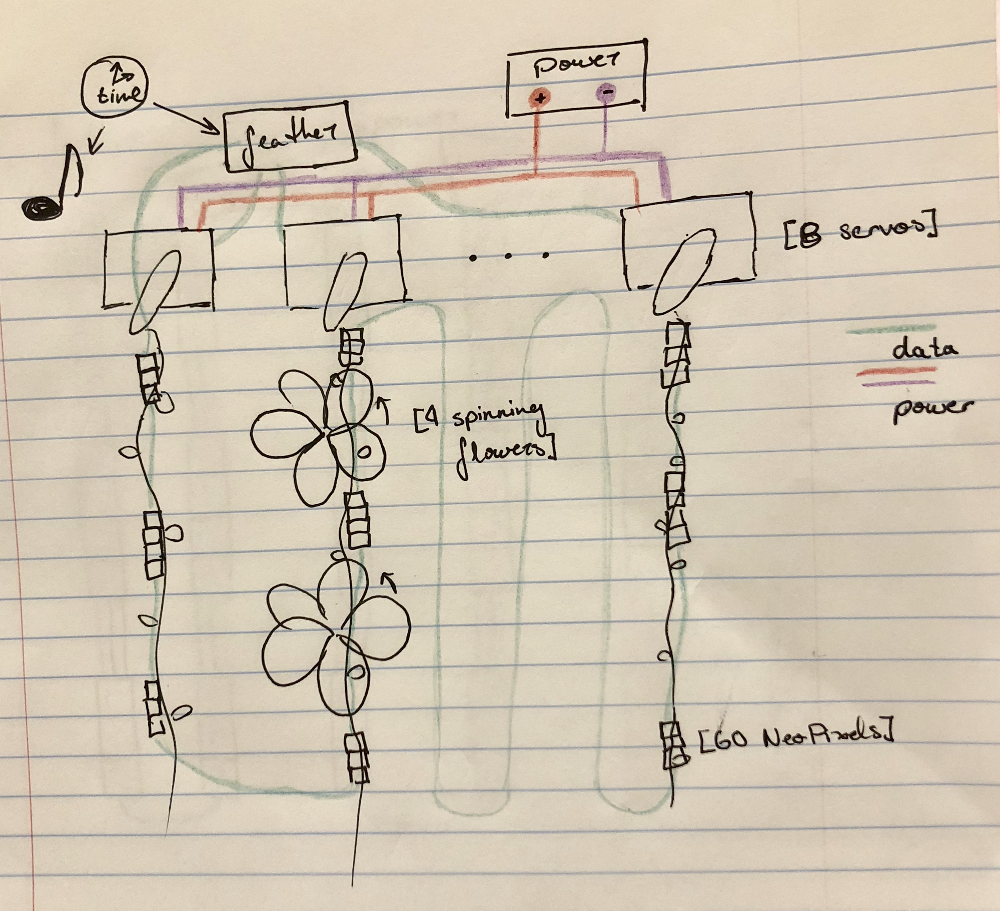
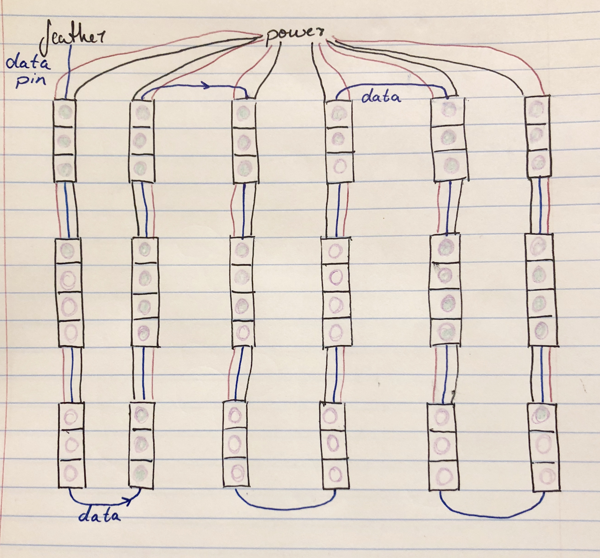
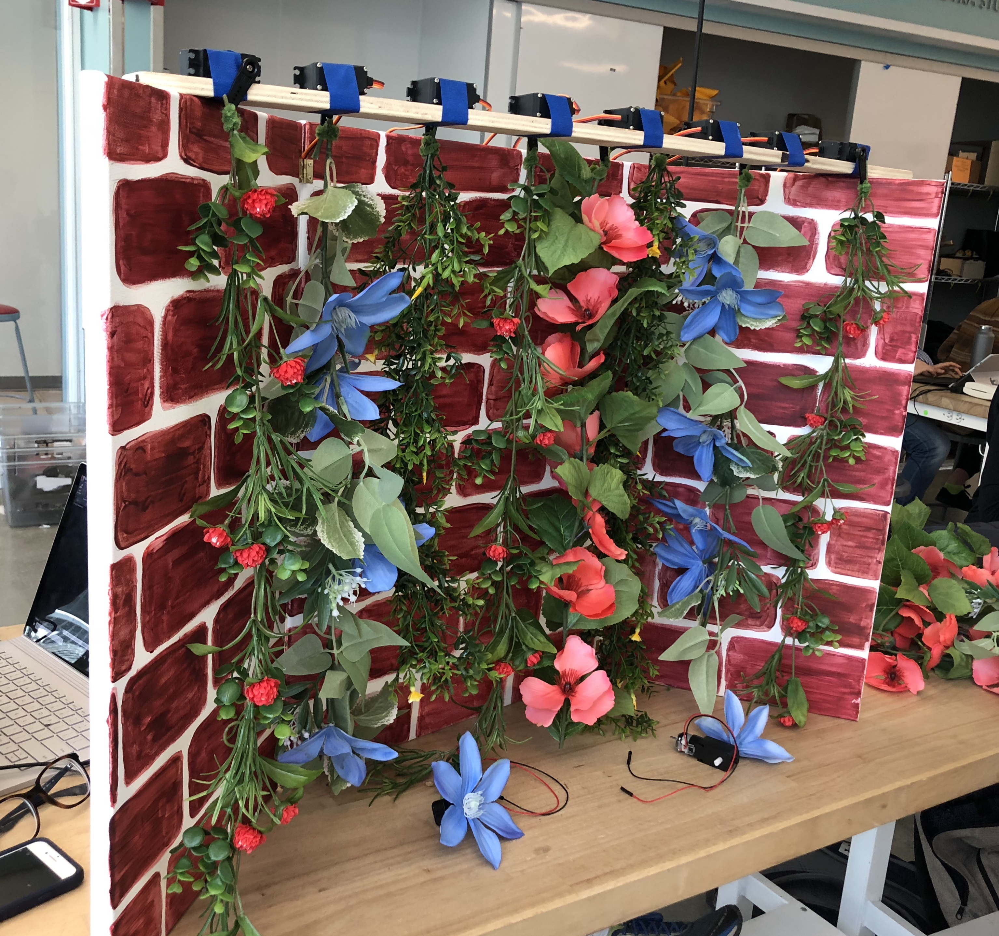
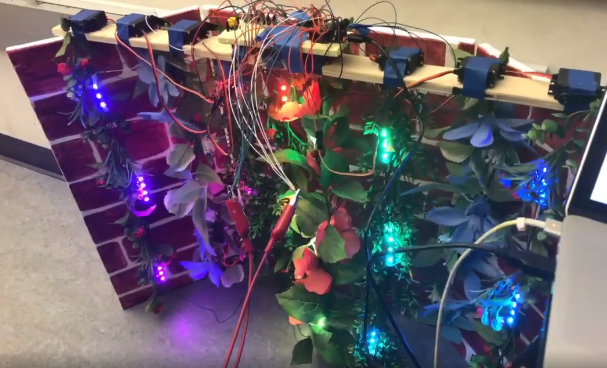

# Viene

Viene is a robotic living wall set to Vivaldi's _The Four Seasons_ that is meant to give people a way to artificially experience the beauty of changing seasons as a living art piece.

## Team
Victor Wang, Rebecca Abraham, Tina Ye, Dipika Khullar, Matthew Bronars

## Summary

Viene cycles through the four seasons of the year along with a soundtrack consisting of segments from Vivaldi's concertis to enhance the mood of each season. Moving vines suspended horizontally along a beam and spinning flowers on the vines powered by DC motors allow for movement as the seasons pass, simulating growth, change, and wind. Strings of neopixels are embedded along each vine and allow for changing colors and patterns according to the season that the wall is experiencing. This project aims to mimick the events of nature through programming and electronics. 

While building this project we ran into a few difficulties.  The first was how to stimulate growth, in the end we decided to use the gradual illumination of NeoPixels as opposed to a motor that wound up the vines.  With numerous NeoPixels, DC motors, and Servos running at the same time, it was difficult to find a way to correctly get the power to all the components without ruining our wires.  Additionally, there were difficulties getting capacitive touch to work seamlessly and making a fully implemented iphone app and programming the NeoPixels.  Even with these difficulties, we still ended up with a living wall that accomplished the primary goals we set out to attain.

## Component Parts

* 8 plastic vines
* 8 servos
* 4 DC motors
* Painted canvas backing with hinges
* 60 neopixels
* Electronic components and wires
* Adafruit feather
* DC Motor + Stepper FeatherWing
* Power supply

### Block Diagram

### NeoPixel Wiring

## Challenges

### Simulating Vine Growth
We initially experimented and mentally prototyped various pulley-based mechanical systems of retracting and lengthening our plastic vines. These included ideas such as using a timing belt that wrapped from the bottom to the top. Another idea included using a high friction surface. Another idea was to use a system of strings. Between the limited range of the servos and the lack of precision of the DC motors, this proved to be too difficult for the limited amount of time allocated for this project. Our alternative was to simulate movement by sequentially lighting up or turning off the LEDs. Since we already had to infrastructure in place to do this, it was easy to implement vine growth in software instead of adding more hardware.

### Power Distribution
We had a lot trouble getting the power distribution for our project to work. Since our project included a large number of electronic components such as 60 neopixels which in total drew about 1.5A at peak and 8 servos which draw about .5A at peak. We initially had all of our compoenents plugged in to a single rail of the breadboard which resulted in uncontrollable servo movement. We spent a long time trying to diagnose the cause and saw that removing the power load by removing some servos from the power rail allowed the servos to be controlled again. We were extremely confused as to why this was happening as the power supply reported constant 5V voltage and nominal current. We eventually checked the voltage at the source of the breadboard power rails where we saw a large voltage drop of under 3V which explained the cause of the uncontrollable servos. Upon further diagnosis, we attempted to increase the voltage at the source power supply to try to acheive 5V at the breadboard rails by pushing almost 9V and 6A before the source wire from the power supply to the breadboard started smoking and we were forced to shut everything off. Upon further diagnosis, we found that the thin wires from the power supply and the breadboard supply rails caused a large amount of heat to build inside the wires and the resistance started to skyrocket as the wires became extremely hot which led to a voltage drop at the rails when the wires became a voltage divider. This issue was resolved after braiding multiple source wires together to distribute power evenly accross the rails by increasing the guage/insulation of the wire.

### Capactive Touch
We attempted to add in capactive touch in our project at the bottom of our vines so that we can implement the ability for the vines to react to our touches to simulate a user disturbing the vines, the vines would suddenly jolt back up and recoil from the intrusion. We tested capactive touch using copper tape using the arduino capactive touch library and tried many different configurations and was not able to get it to be reliable enough to the point where we could use it to distinguish a human touch. We decided to remove this aspect of our project and instead defer the ability to interact directly with the vines through a physical touch medium such as buttons or through the iPhone app

### iPhone App
We attempted to build an iPhone app that would allow for fine grained control over seasons, timeline, and any other human user interaction that was required for the project. We implemented a basic solution and saw that the proof of concept worked, but we were unable to implement all of the required components to work together with the bluetooth portion in time due to the fast deadline of the project.

### Addressing NeoPixels
Individual NeoPixels are parametrized by their position along the strand; this allows for all the NeoPixels to be controlled by a single pin. The way we wired the data line (snaking through by alternating top to bottom then bottom to top) was for convenience, but it led to coding challenges later. Furthermore, the vines initially consisted of ten NeoPixels each, but because of damage during transportation, we later lost two NeoPixels. This meant more exceptions to handle in code. We dealt with the added complexity with a single function that handled the logic for converting vine numbers and positions along a vine to an index into the strand.

## Timeline

- Week 1: Wrote proposal, planned logistics, discussed the direction of our project
- Week 2: Purchased materials, planned out and finalized design
- Week 3: Assembled hardware, created the artistic components
- Week 4: Tested components, wrote code for motors and neopixels
- Week 5: Fine-tuning, Showcase presentation and demo

## Completed Work

Viene is the amalgamation of various skills that we acquired while taking Design Innovation 23: from the DC motors controlling the spinning flowers, to the servos that jitter the vines, and the neopixels that dominate the transition of the seasons, all aspects of this project have been built upon a unit in this course. Looking back at the various prototypes that led us to this final project, it is clear that Viene embodies the spirit of iteration and learning from doing.  Moreover, as with all projects, the final result deviated significantly from what we originally imagined; but because of this we learned to be adaptive, innovative, and tenacious. These are skills that are not only important to success in the field of design, but also in college and life in general.  

[WATCH: Viene Final Video Demo](https://www.youtube.com/watch?v=HiZiRdkXOhQ)  
 
  
_Early prototyping with servos_  
 

 
_Testing our moving vines and neopixels_  
 

## References and links
[Final Showcase Presentation Poster](./Viene%20Poster.pdf)

### Resources
[Adafruit Feather Documentation](https://learn.adafruit.com/adafruit-feather-32u4-bluefruit-le/overview)  
[NeoPixel Uberguide](https://learn.adafruit.com/adafruit-neopixel-uberguide/the-magic-of-neopixels)  
[FeatherWing Guide](https://learn.adafruit.com/adafruit-stepper-dc-motor-featherwing)
